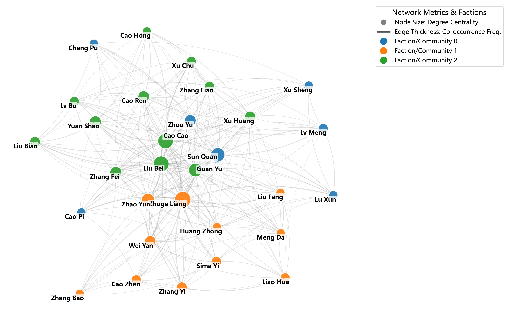
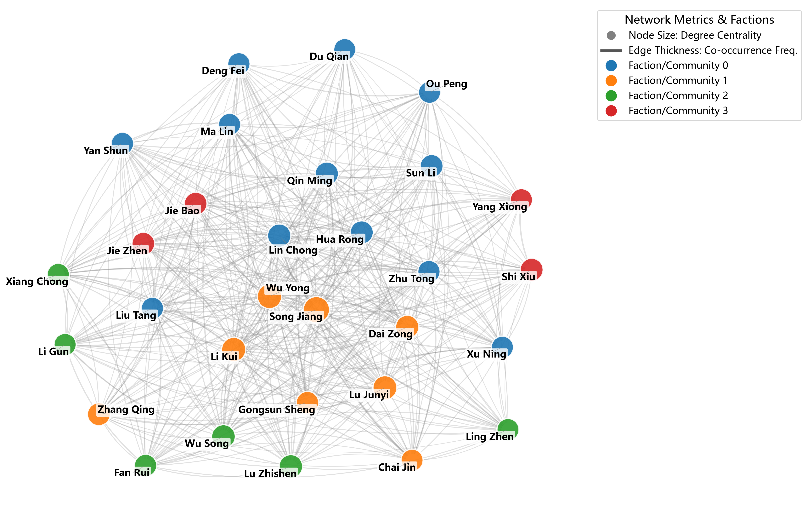
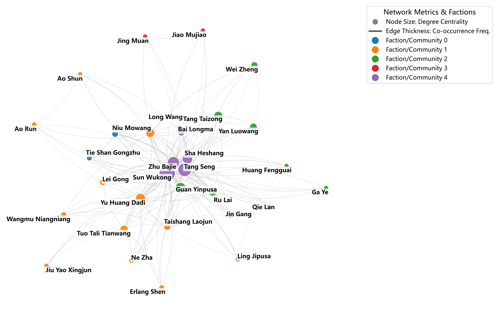
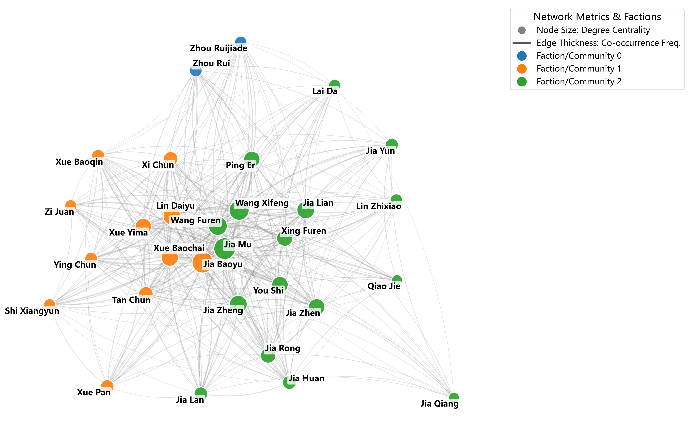

# Network Topology as Genre Fingerprint: Character Networks in China's Four Great Classical Novels

[English](#english) | [中文](#zhongwen)

<a id="english"></a>

This repository contains the dataset, analysis scripts, and supplementary materials for the paper:

**Network Topology as Genre Fingerprint: A Comparative Computational Analysis of Character Networks in China's Four Great Classical Novels**

*M Lintang Maulana Zulfan, Universitas Gadjah Mada*
*(Under review at Digital Scholarship in the Humanities, Oxford University Press)*

## Overview

This project applies multi-scale Social Network Analysis (SNA) to the character interaction networks of the Four Great Classical Novels of Chinese literature (四大名著):

1. *Romance of the Three Kingdoms* (三国演义) — 70 nodes, 656 edges
2. *Water Margin* (水浒传) — 157 nodes, 4,862 edges
3. *Journey to the West* (西游记) — 65 nodes, 247 edges
4. *Dream of the Red Chamber* (红楼梦) — 95 nodes, 851 edges

The study demonstrates that each novel produces a topologically distinct network signature that functions as a computational genre fingerprint. Analysis includes node-level centrality (degree, betweenness, eigenvector), global network properties (clustering, path length, assortativity), Louvain community detection, degree distribution fitting, and small-world analysis against Erdős–Rényi null models.

<p align="center">
  
  
</p>
<p align="center">
  
  
</p>

## Key Findings

| Novel | Topology | Small-world σ | Assortativity |
|-------|----------|---------------|---------------|
| Three Kingdoms | Multi-polar | 2.504 | −0.195 |
| Water Margin | Hub-and-spoke | 2.055 | −0.004 |
| Journey to the West | Star-shaped | 6.883 | −0.471 |
| Dream of the Red Chamber | Hierarchical cluster | 3.704 | −0.414 |

- All four networks exhibit small-world properties (σ > 2.0)
- A **co-occurrence anomaly** was identified: community detection groups antagonists together because literary conflict requires textual co-occurrence
- The concept of **passive centrality** was introduced through Tang Seng's high degree centrality despite narrative passivity

## Repository Structure

### 1. Data Collection and Preprocessing
- `01a_scrape_three_kingdoms.py` ... `01d_scrape_red_chamber.py` — Web scrapers for Wikisource chapter texts.
- `02a_extract_three_kingdoms.py` ... `02d_extract_red_chamber.py` — Named entity extraction using `jieba` POS-tagging (`nr`) with custom alias dictionaries.
- `entities_*_verified.csv` — Manually verified alias dictionaries mapping character aliases to canonical names.

### 2. Network Construction and Node-Level Analysis
- `03_build_network.py` — Paragraph-based co-occurrence network construction (edge weight threshold ≥ 3).
- `04_calculate_centrality.py` — Degree, betweenness, eigenvector centrality and Louvain community detection.
- `05a_generate_graphs.py` and `05b_generate_pngs.py` — Network visualization with Fruchterman-Reingold layout.

### 3. Global Network Analysis (New for DSH)
- `06_global_network_analysis.py` — Computes global network properties, degree distribution fitting, Erdős–Rényi and Barabási–Albert null model comparisons, small-world coefficients, and robustness analysis.

### 4. Generated Datasets
- `network_*.gexf` — Complete network graphs (Gephi/NetworkX compatible).
- `edgelist_*.csv` — Raw interaction edge lists with weights.
- `centrality_metrics_summary.csv` — Node-level centrality metrics for top characters.
- `global_network_properties.csv` — Clustering coefficient, transitivity, path length, diameter, assortativity.
- `null_model_comparison.csv` — Small-world analysis (γ, λ, σ) against ER and BA null models.
- `degree_distribution_analysis.csv` — Power-law fitting results (α, x_min, log-likelihood ratios).
- `robustness_analysis.csv` — Targeted vs. random node removal robustness.
- `degree_distribution_plot.png` — Four-panel log-log degree distribution figure.

## Reproducibility

To reproduce the findings:

1. Ensure Python 3.9+ is installed.
2. Install dependencies:
   ```
   pip install requests beautifulsoup4 jieba networkx python-louvain pandas matplotlib adjustText pypinyin powerlaw numpy scipy
   ```
3. (Optional) Run the `01*_scrape_*.py` scripts to fetch the latest raw texts from Wikisource. Raw texts are not included due to file size.
4. Run `03_build_network.py` followed by `04_calculate_centrality.py` for node-level analysis.
5. Run `06_global_network_analysis.py` for global properties, null models, and degree distribution analysis.
6. Open `.gexf` files in [Gephi](https://gephi.org/) for interactive visualization.

## License and Citation

The code and datasets in this repository are open-sourced under the MIT License.

If you use this code or dataset, please cite:

> Zulfan, M. L. M. (2026). Network Topology as Genre Fingerprint: A Comparative Computational Analysis of Character Networks in China's Four Great Classical Novels. *Manuscript under review at Digital Scholarship in the Humanities*.

---

<a id="zhongwen"></a>

# 网络拓扑作为文体指纹：中国四大名著人物网络的比较计算分析

[English](#english) | [中文](#zhongwen)

本仓库包含以下学术论文的数据集、分析脚本和补充材料：

**Network Topology as Genre Fingerprint: A Comparative Computational Analysis of Character Networks in China's Four Great Classical Novels** (网络拓扑作为文体指纹：中国四大名著人物网络的比较计算分析)

*M Lintang Maulana Zulfan，日惹加查马达大学*
*(审稿中，Digital Scholarship in the Humanities，牛津大学出版社)*

## 概述

本项目对中国文学四大名著的人物交互网络进行多尺度社会网络分析 (SNA)：

1. *Romance of the Three Kingdoms* (三国演义) — 70 节点，656 条边
2. *Water Margin* (水浒传) — 157 节点，4,862 条边
3. *Journey to the West* (西游记) — 65 节点，247 条边
4. *Dream of the Red Chamber* (红楼梦) — 95 节点，851 条边

研究表明，每部小说都产生了拓扑上独特的网络特征，可作为计算文体指纹。分析包括节点级中心性（度、中介、特征向量）、全局网络属性（聚类系数、路径长度、同配性）、Louvain 社区发现、度分布拟合以及基于 Erdős–Rényi 零模型的小世界分析。

<p align="center">
  
  
</p>
<p align="center">
  
  
</p>

## 主要发现

| 小说 | 拓扑结构 | 小世界系数 σ | 同配系数 |
|------|----------|-------------|---------|
| 三国演义 | 多极结构 | 2.504 | −0.195 |
| 水浒传 | 中心辐射型 | 2.055 | −0.004 |
| 西游记 | 星形结构 | 6.883 | −0.471 |
| 红楼梦 | 层级集群 | 3.704 | −0.414 |

- 四部小说网络均呈现小世界特性 (σ > 2.0)
- 发现了**共现异常**现象：社区发现算法将对立角色分为同一社区，因为文学冲突需要文本共现
- 通过唐僧高度中心性但叙事被动的特征，提出了**被动中心性**概念

## 仓库结构

### 1. 数据收集与预处理
- `01a_scrape_three_kingdoms.py` ... `01d_scrape_red_chamber.py` — 维基文库章节文本爬虫。
- `02a_extract_three_kingdoms.py` ... `02d_extract_red_chamber.py` — 使用 `jieba` 词性标注 (`nr`) 和自定义别名词典进行命名实体提取。
- `entities_*_verified.csv` — 经人工验证的别名词典。

### 2. 网络构建与节点级分析
- `03_build_network.py` — 基于段落的共现网络构建（边权阈值 ≥ 3）。
- `04_calculate_centrality.py` — 度、中介、特征向量中心性及 Louvain 社区发现。
- `05a_generate_graphs.py` 和 `05b_generate_pngs.py` — 使用 Fruchterman-Reingold 布局进行网络可视化。

### 3. 全局网络分析（DSH 新增）
- `06_global_network_analysis.py` — 计算全局网络属性、度分布拟合、Erdős–Rényi 和 Barabási–Albert 零模型比较、小世界系数及鲁棒性分析。

### 4. 生成的数据集
- `network_*.gexf` — 完整网络图（兼容 Gephi/NetworkX）。
- `edgelist_*.csv` — 原始交互边列表及权重。
- `centrality_metrics_summary.csv` — 主要人物的节点级中心性指标。
- `global_network_properties.csv` — 聚类系数、传递性、路径长度、直径、同配性。
- `null_model_comparison.csv` — 基于 ER 和 BA 零模型的小世界分析 (γ, λ, σ)。
- `degree_distribution_analysis.csv` — 幂律拟合结果 (α, x_min, 对数似然比)。
- `robustness_analysis.csv` — 定向与随机节点移除的鲁棒性分析。
- `degree_distribution_plot.png` — 四面板双对数度分布图。

## 可重复性

复现研究结果：

1. 确保已安装 Python 3.9+。
2. 安装依赖项：
   ```
   pip install requests beautifulsoup4 jieba networkx python-louvain pandas matplotlib adjustText pypinyin powerlaw numpy scipy
   ```
3. （可选）运行 `01*_scrape_*.py` 脚本从维基文库获取最新原始文本。由于文件较大，原始文本未包含在仓库中。
4. 运行 `03_build_network.py`，然后运行 `04_calculate_centrality.py` 进行节点级分析。
5. 运行 `06_global_network_analysis.py` 进行全局属性、零模型和度分布分析。
6. 在 [Gephi](https://gephi.org/) 中打开 `.gexf` 文件进行交互式可视化。

## 许可与引用

本仓库中的代码和数据集遵循 MIT 许可证开源。

如果您在研究中使用了本工作，请引用：

> Zulfan, M. L. M. (2026). Network Topology as Genre Fingerprint: A Comparative Computational Analysis of Character Networks in China's Four Great Classical Novels. *审稿中，Digital Scholarship in the Humanities*。
